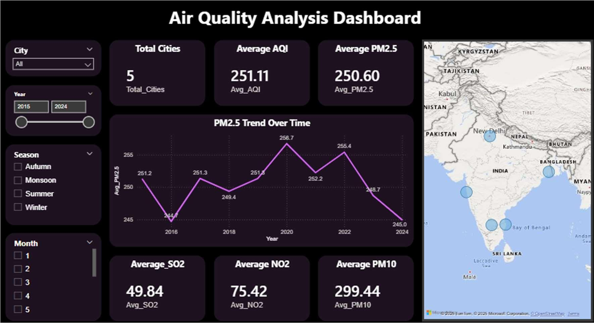
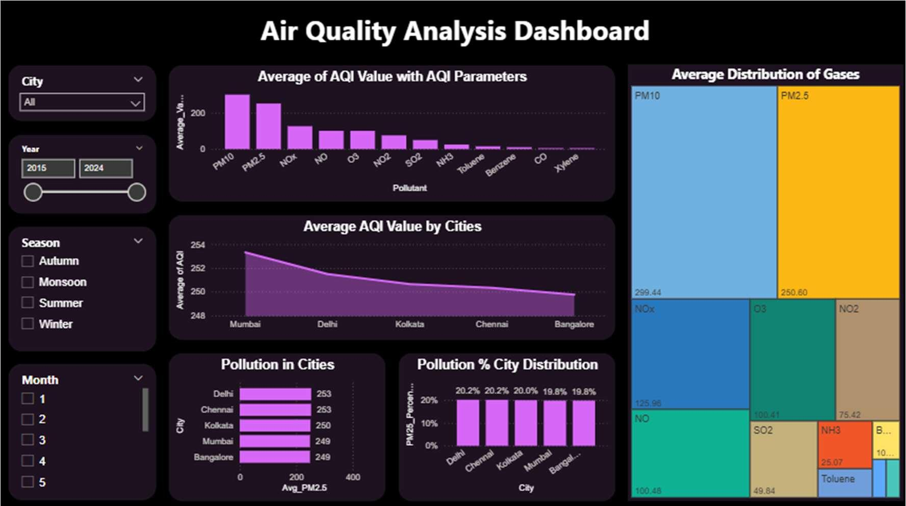
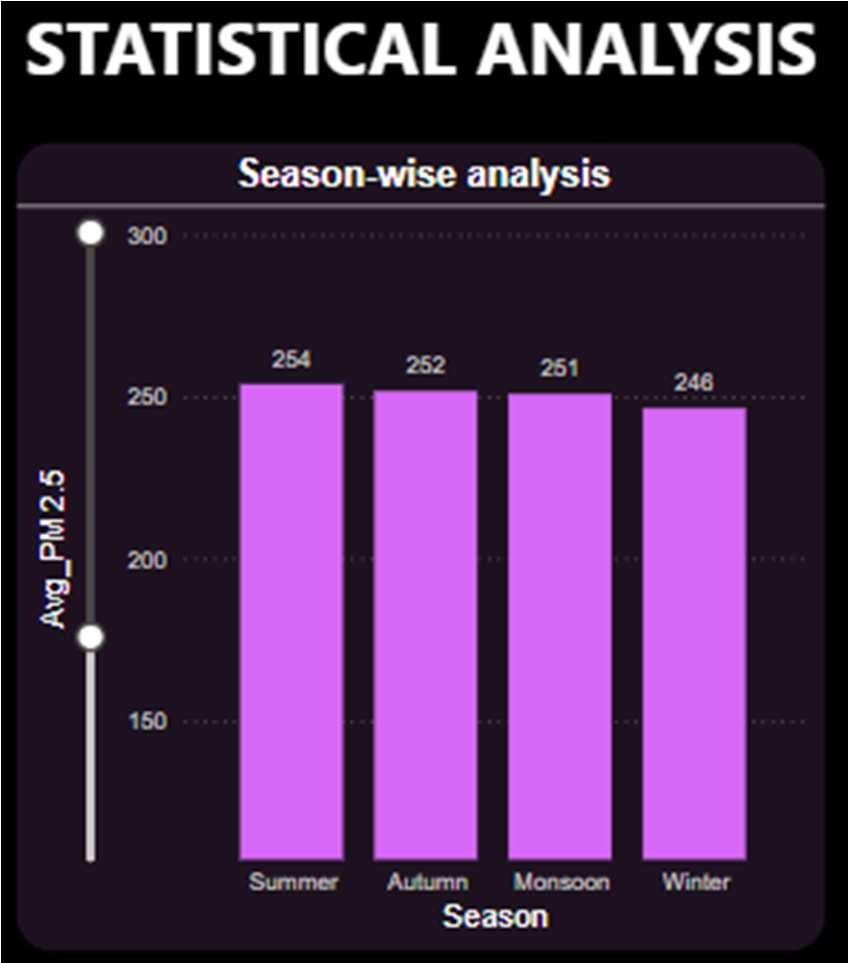
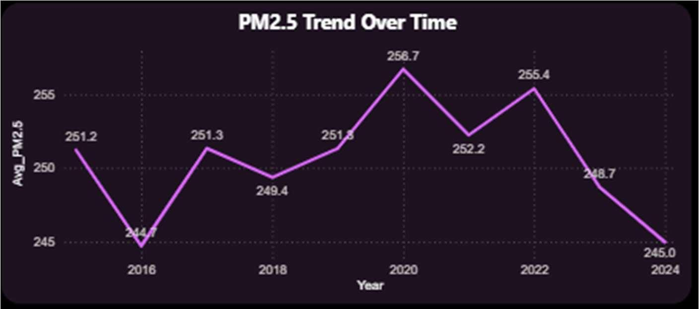
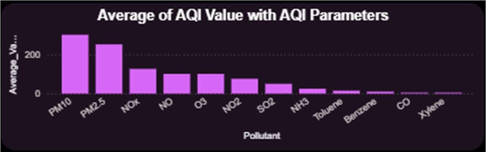

# Air Quality Analysis & Interpretation Dashboard 🌬️📊

A comprehensive **Power BI Dashboard** project analyzing urban air quality, pollutant dynamics, and seasonal trends across major cities. This project integrates Exploratory Data Analysis (EDA), Statistical Analysis, Unsupervised Machine Learning (K-Means Clustering), and interactive visualization to deliver actionable environmental insights.

Developed by: **Aryan Raj**  
*B.Tech CSE Data Science | University of Petroleum and Energy Studies (UPES), Dehradun*

---

## 📌 Project Overview
Urban air pollution is a critical public health and environmental crisis. This dashboard provides a holistic view of pollution levels, seasonal trends, and pollutant behavior. By visualizing clusters, correlations, and comparisons, it enables stakeholders to identify high-risk zones, dominant pollutants, and temporal patterns to support data-driven policy decisions.

### Key Tools & Technologies:
*   **BI Platform**: Power BI Desktop
*   **Data Prep & Processing**: Power Query, DAX (Data Analysis Expressions)
*   **Machine Learning**: Python integration in Power BI (K-Means Clustering)
*   **Dataset**: `city_day.csv` (containing daily city-level air quality parameters like AQI, PM2.5, PM10, NO2, SO2, CO, etc.)

---

## 🖥️ Dashboard Architecture & Key Pages

The dashboard is structured into four primary analysis modules:

### 1. Exploratory Data Analysis (EDA) Insights
Explore initial pollutant variations, distribution patterns, and relationships between key air quality indicators.
*   **Seasonal Heatmaps**: Analyze how weather dynamics drive pollutant concentrations (e.g., PM2.5 and PM10 peaking during specific seasons like summer and monsoon).
*   **PM2.5 Distribution**: A right-skewed histogram showing that while most days are moderately polluted, periodic extreme pollution spikes occur due to episodic events.
*   **Pollutant Relationships**: A scatter plot of PM10 vs PM2.5 demonstrating a strong positive correlation, indicating shared emission origins (traffic, combustion, and dust). Delhi displays the highest risk exposure in this analysis.
*   **Yearly Trends**: Displays fluctuating improvement patterns from 2015 to 2024, showing a sharp rise in 2020 followed by gradual declines, emphasizing the need for persistent urban policies.

🖼️ *Visualizations from the EDA section:*



---

### 2. Statistical Analysis & K-Means Clustering
Combining inferential statistics with unsupervised machine learning to group cities based on pollution profiles.
*   **Seasonal ANOVA/Differences**: Statistically confirms that season strongly impacts air quality, with Summer (~254 µg/m³) and Monsoon (~261 µg/m³) showing significantly higher average PM2.5 compared to Winter (~248 µg/m³).
*   **City Segmentation (K-Means)**: Segments cities into three distinct clusters:
    *   🟢 **Cluster 1 (Low Pollution)**: Residential or strictly regulated zones with cleaner profiles.
    *   🟡 **Cluster 2 (Moderate Pollution)**: Transitional cities experiencing mixed industrial and urban activity.
    *   🔴 **Cluster 3 (High Pollution)**: Highly industrial, traffic-dense cities with elevated health risks.
*   **Particulate Corelation**: Confirms that rising fine particulate matter (PM2.5) corresponds directly to rising dust pollution (PM10).

🖼️ *Clustering Visuals:*


---

### 3. Filter-Interactive Dashboard
A dynamic, customizable reporting view allowing users to slice and dice the data.
*   **Interactive Slicers**: Filter by **City, Year, Season, and Month** to perform localized root-cause analysis.
*   **AQI & Particulate Tracker**: Monitor how average AQI levels remain consistently high (typically in the 250-260 range), indicating a universally polluted urban environment.
*   **Pollutant-wise Breakdown**: Tracks specific pollutant levels over time, revealing that while SO2 and NO2 remain low, PM10 is the critical driver of overall poor AQI.

🖼️ *Interactive Views:*


---

### 4. Comparison & Share Dashboard
Comparative analysis of pollutant load distribution across cities and pollutant types.
*   **Pollutant Load Treemap**: Visualizes the contribution of each pollutant, highlighting PM10 and PM2.5 as the main drivers of AQI deterioration.
*   **City-wise AQI Leaderboard**: Highlights Delhi, Mumbai, and Kolkata as the highest AQI zones due to vehicular density and industrial emissions.
*   **Uniform Contribution**: Shows that major cities contribute around 18–20% of the total PM2.5 load, indicating that pollution is a regional, multi-city issue rather than an isolated local one.

🖼️ *Comparison Visuals:*


---

## 📈 Key Insights & Recommendations
1.  **Particulate Matter Dominance**: PM10 and PM2.5 are the primary pollutants. Emission controls must focus heavily on vehicular emissions, construction dust, and industrial combustion.
2.  **Regional Policy Approach**: Since major cities share similar pollution shares (18-20% contribution each), isolated city-level policies are insufficient. Regional airshed management is essential.
3.  **Seasonal Interventions**: Stricter emission caps should be enforced dynamically during summer and monsoon seasons when meteorological factors exacerbate pollution accumulation.

---

## 📂 Repository Structure
```directory
.
├── assets/                          # Extracted dashboard screenshots
│   ├── page_1_img_1.jpg
│   ├── page_2_img_1.jpg
│   ├── page_2_img_2.jpg
│   └── ... (other visual assets)
├── 500120443_AryanRaj_DVIproject.pdf# Detailed PDF Project Report
├── city_day.csv                     # Raw air quality dataset
├── Project_DVI.pbix                 # Power BI Desktop source file
└── README.md                        # Project documentation (this file)
```

---

## 🚀 How to Run the Project
1.  **Clone the repository**:
    ```bash
    git clone https://github.com/aryanraj71/Air-Quality-Analysis-Dashboard.git
    cd Air-Quality-Analysis-Dashboard
    ```
2.  **Open in Power BI**:
    *   Make sure you have [Power BI Desktop](https://powerbi.microsoft.com/desktop/) installed.
    *   Double-click `Project_DVI.pbix` to launch the dashboard.
3.  **Verify Python Script Integration (Optional)**:
    *   For K-Means clustering visual execution, ensure Python is installed and configured in Power BI: `Options and settings > Options > Python scripting`.
    *   Required libraries: `pandas`, `scikit-learn`, `matplotlib`.
